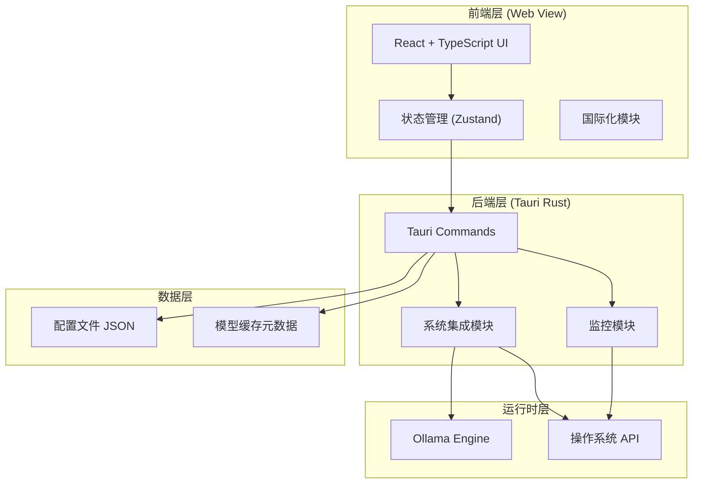
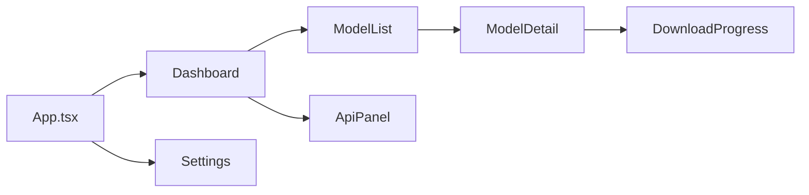

# Local LLM Deployer 技术设计文档

Feature Name: local-llm-deployer
Updated: 2026-04-08

## 描述

Local LLM Deployer 是一款基于 Tauri 2.0 构建的跨平台桌面应用程序，帮助用户在本地一键部署、管理和切换开源大语言模型。应用通过集成 Ollama 推理引擎，提供从模型推荐、下载、安装到 API 生成的全流程可视化体验。

## 系统架构



## 架构组件说明

### 前端层

| 组件 | 技术栈 | 职责 |
|------|--------|------|
| UI 框架 | React 18 + TypeScript | 渲染用户界面组件 |
| 状态管理 | Zustand | 管理全局应用状态 |
| 样式方案 | Tailwind CSS | 原子化 CSS 样式 |
| 国际化 | i18next | 多语言支持 |
| HTTP 客户端 | fetch API | 与 Ollama API 通信 |

### 后端层（Tauri Rust）

| 模块 | 职责 |
|------|------|
| system commands | 系统配置检测（CPU/GPU/内存/磁盘） |
| ollama commands | Ollama 安装、启动、停止、版本管理 |
| model commands | 模型下载、删除、切换 |
| monitor commands | 运行状态监控、资源使用率 |
| config commands | 配置导入导出、存储路径管理 |

### 运行时层

| 组件 | 职责 |
|------|------|
| Ollama Engine | 本地模型推理引擎，提供 REST API |
| OS APIs | 系统信息采集、进程管理、文件操作 |

## 核心模块设计

### 1. 系统配置检测模块

```rust
// Tauri Command: 检测系统配置
#[tauri::command]
async fn detect_system_config() -> Result<SystemConfig, String> {
    // 检测 CPU 信息
    let cpu_info = detect_cpu()?;
    
    // 检测 GPU 信息 (使用 sysinfo crate + nvml for NVIDIA)
    let gpu_info = detect_gpu()?;
    
    // 检测内存信息
    let memory_info = detect_memory()?;
    
    // 检测磁盘信息
    let disk_info = detect_disk()?;
    
    Ok(SystemConfig {
        cpu: cpu_info,
        gpu: gpu_info,
        memory: memory_info,
        disk: disk_info,
        timestamp: Utc::now(),
    })
}
```

**数据结构：**

```rust
struct SystemConfig {
    cpu: CpuInfo,
    gpu: Vec<GpuInfo>,
    memory: MemoryInfo,
    disk: DiskInfo,
    timestamp: DateTime<Utc>,
}

struct CpuInfo {
    name: String,
    cores: u32,
    threads: u32,
    frequency_mhz: u64,
}

struct GpuInfo {
    name: String,
    vendor: String,
    memory_bytes: u64,
    driver_version: String,
    compute_capability: Option<(u32, u32)>,
}

struct MemoryInfo {
    total_bytes: u64,
    available_bytes: u64,
}

struct DiskInfo {
    total_bytes: u64,
    available_bytes: u64,
    mount_point: String,
}
```

### 2. Ollama 管理模块

```rust
// Tauri Command: 安装 Ollama
#[tauri::command]
async fn install_ollama() -> Result<InstallResult, String> {
    let platform = detect_platform()?;
    let arch = detect_arch()?;
    
    // 下载对应平台的 Ollama 安装包
    let download_url = format!(
        "https://github.com/ollama/ollama/releases/download/v{}/ollama-{}-{}.tgz",
        CURRENT_VERSION, platform, arch
    );
    
    // 下载并解压到用户目录
    let install_path = expand_path("~/.local/bin/ollama")?;
    
    download_and_extract(download_url, install_path).await?;
    
    // 验证安装
    let version = Command::new("ollama").arg("--version").output()?;
    
    Ok(InstallResult { version })
}

// Tauri Command: 启动 Ollama 服务
#[tauri::command]
async fn start_ollama() -> Result<(), String> {
    // 检查是否已运行
    if is_ollama_running().await? {
        return Ok(());
    }
    
    // 启动 Ollama 服务（后台运行）
    let child = Command::new("ollama")
        .arg("serve")
        .spawn()
        .map_err(|e| e.to_string())?;
    
    // 等待服务就绪
    wait_for_service("localhost:11434", Duration::from_secs(30)).await?;
    
    Ok(())
}

// Tauri Command: 获取 Ollama 状态
#[tauri::command]
async fn get_ollama_status() -> Result<OllamaStatus, String> {
    let running = is_ollama_running().await?;
    let version = get_ollama_version().ok();
    let models = list_local_models().await?;
    
    Ok(OllamaStatus { running, version, models })
}
```

### 3. 模型管理模块

```rust
// Tauri Command: 获取模型列表
#[tauri::command]
async fn get_model_list() -> Result<Vec<ModelInfo>, String> {
    // 获取官方模型列表
    let official_models = fetch_official_models().await?;
    
    // 获取本地已下载模型
    let local_models = list_local_models().await?;
    
    // 合并并标记
    Ok(merge_model_lists(official_models, local_models))
}

// Tauri Command: 下载模型
#[tauri::command]
async fn download_model(model_id: String, progress: State<'_, ProgressTracker>) -> Result<(), String> {
    // 检查磁盘空间
    let required = estimate_model_size(&model_id)?;
    let available = get_available_disk_space()?;
    
    if required > available {
        return Err("Insufficient disk space".to_string());
    }
    
    // 执行下载
    let result = Command::new("ollama")
        .arg("pull")
        .arg(&model_id)
        .output_with_progress(progress)
        .await?;
    
    if !result.success() {
        return Err(String::from_utf8_lossy(&result.stderr).to_string());
    }
    
    Ok(())
}

// Tauri Command: 启动模型
#[tauri::command]
async fn start_model(model_id: String) -> Result<(), String> {
    // 检查是否已有模型在运行
    let current = get_current_model().await?;
    if current.is_some() {
        return Err("Another model is already running".to_string());
    }
    
    // 检查显存是否足够
    let required = get_model_vram_requirement(&model_id)?;
    let available = get_available_vram()?;
    
    if required > available {
        return Err(format!(
            "Insufficient VRAM: required {}MB, available {}MB",
            required / 1024 / 1024,
            available / 1024 / 1024
        ));
    }
    
    // 启动模型
    let child = Command::new("ollama")
        .arg("run")
        .arg("-d")  // 后台运行
        .arg(&model_id)
        .spawn()
        .map_err(|e| e.to_string())?;
    
    // 保存进程 ID
    save_model_process(&model_id, child.id())?;
    
    Ok(())
}

// Tauri Command: 停止模型
#[tauri::command]
async fn stop_model() -> Result<(), String> {
    let current = get_current_model().await?;
    
    if let Some((model_id, pid)) = current {
        // 发送 SIGTERM
        kill_process(pid, Signal::SIGTERM)?;
        
        // 等待 30 秒优雅退出
        let timeout = Duration::from_secs(30);
        if !wait_for_process_exit(pid, timeout).await? {
            // 强制终止
            kill_process(pid, Signal::SIGKILL)?;
        }
        
        remove_model_process(&model_id)?;
    }
    
    Ok(())
}

// Tauri Command: 切换模型
#[tauri::command]
async fn switch_model(new_model_id: String) -> Result<(), String> {
    // 先停止当前模型
    stop_model().await?;
    
    // 再启动新模型
    start_model(new_model_id).await
}
```

### 4. 状态监控模块

```rust
// Tauri Command: 获取资源使用率
#[tauri::command]
async fn get_resource_usage() -> Result<ResourceUsage, String> {
    let cpu_percent = get_cpu_usage()?;
    let memory = get_memory_usage()?;
    let gpu = get_gpu_usage()?;  // 使用 nvml bindings
    
    Ok(ResourceUsage {
        cpu_percent,
        memory_used: memory.used,
        memory_total: memory.total,
        gpu_percent: gpu.map(|g| g.utilization),
        gpu_memory_used: gpu.map(|g| g.memory_used),
        gpu_memory_total: gpu.map(|g| g.memory_total),
    })
}

// Tauri Command: 获取模型运行状态
#[tauri::command]
async fn get_model_status() -> Result<ModelStatus, String> {
    let running = is_model_running().await?;
    let model_id = get_current_model().await?.map(|(id, _)| id);
    let gpu_memory = get_model_vram_usage().await?;
    
    Ok(ModelStatus {
        running,
        model_id,
        gpu_memory_bytes: gpu_memory,
        uptime_seconds: get_process_uptime().ok(),
    })
}
```

### 5. API 信息生成模块

```rust
// Tauri Command: 生成 API 信息
#[tauri::command]
async fn generate_api_info() -> Result<ApiInfo, String> {
    let ollama_status = get_ollama_status().await?;
    let model_status = get_model_status().await?;
    
    if !ollama_status.running {
        return Err("Ollama is not running".to_string());
    }
    
    let base_url = "http://localhost:11434";
    
    Ok(ApiInfo {
        api_address: base_url.to_string(),
        api_key: None,  // Ollama 默认无认证
        model_id: model_status.model_id,
        provider: "ollama".to_string(),
        provider_version: ollama_status.version,
        endpoints: vec![
            Endpoint { path: "/api/generate".to_string(), method: "POST".to_string(), description: "Generate completion".to_string() },
            Endpoint { path: "/api/chat".to_string(), method: "POST".to_string(), description: "Chat completion".to_string() },
            Endpoint { path: "/api/tags".to_string(), method: "GET".to_string(), description: "List models".to_string() },
        ],
    })
}

// Tauri Command: 验证 API 可用性
#[tauri::command]
async fn verify_api_info() -> Result<VerifyResult, String> {
    // 1. 测试基础连接
    let health_response = reqwest::get("http://localhost:11434/api/tags").await?;
    
    if !health_response.status().is_success() {
        return Ok(VerifyResult {
            success: false,
            api_reachable: false,
            model_responsive: false,
            error_message: Some(format!("Health check failed: {}", health_response.status())),
        });
    }
    
    // 2. 测试模型推理
    let model_id = get_current_model().await?.map(|(id, _)| id);
    
    if let Some(model) = model_id {
        let test_response = test_model_inference(&model).await?;
        
        return Ok(VerifyResult {
            success: test_response.success,
            api_reachable: true,
            model_responsive: test_response.success,
            error_message: test_response.error,
        });
    }
    
    Ok(VerifyResult {
        success: true,
        api_reachable: true,
        model_responsive: false,
        error_message: Some("No model is currently running".to_string()),
    })
}
```

## 数据模型

### 配置文件结构 (`config.json`)

```json
{
  "version": "1.0.0",
  "settings": {
    "model_storage_path": "~/.ollama/models",
    "language": "zh-CN",
    "auto_start_ollama": true,
    "theme": "system"
  },
  "custom_model_sources": [
    {
      "name": "HuggingFace",
      "url": "https://huggingface.co/api",
      "enabled": true
    }
  ],
  "recent_models": ["llama3:8b", "qwen2.5:7b"]
}
```

### 模型元数据 (`models.json`)

```json
{
  "models": [
    {
      "id": "llama3:8b",
      "name": "Llama 3 8B",
      "provider": "ollama",
      "size_bytes": 4661224448,
      "quantization": "FP16",
      "parameters": 8000000000,
      "vram_required_bytes": 16000000000,
      "description": "Meta's latest open source model",
      "download_url": "https://ollama.ai/library/llama3",
      "last_used": "2026-04-08T10:30:00Z",
      "is_downloaded": true,
      "is_running": false
    }
  ]
}
```

### API 信息结构

```rust
struct ApiInfo {
    api_address: String,      // "http://localhost:11434"
    api_key: Option<String>, // None for Ollama default
    model_id: Option<String>, // "llama3:8b"
    provider: String,         // "ollama"
    provider_version: Option<String>,
    endpoints: Vec<Endpoint>,
}

struct Endpoint {
    path: String,
    method: String,
    description: String,
}

struct VerifyResult {
    success: bool,
    api_reachable: bool,
    model_responsive: bool,
    error_message: Option<String>,
}
```

## 智能推荐算法

```rust
fn recommend_models(config: &SystemConfig) -> Vec<ModelRecommendation> {
    let available_vram = config.gpu.iter()
        .map(|g| g.memory_bytes)
        .sum::<u64>();
    
    let available_ram = config.memory.available_bytes;
    
    let mut recommendations = vec![];
    
    for model in ALL_MODELS {
        let score = calculate_compatibility_score(model, available_vram, available_ram);
        
        if score > 0 {
            recommendations.push(ModelRecommendation {
                model: model.clone(),
                score,
                can_run: score >= 0.8,
                warnings: get_warnings(model, available_vram, available_ram),
            });
        }
    }
    
    // 按分数降序排序
    recommendations.sort_by(|a, b| b.score.partial_cmp(&a.score).unwrap());
    
    recommendations
}

fn calculate_compatibility_score(
    model: &ModelInfo,
    available_vram: u64,
    available_ram: u64,
) -> f64 {
    let vram_ratio = if model.vram_required > 0 {
        (available_vram as f64 / model.vram_required as f64).min(1.0)
    } else {
        1.0
    };
    
    let ram_ratio = if model.ram_required > 0 {
        (available_ram as f64 / model.ram_required as f64).min(1.0)
    } else {
        1.0
    };
    
    // 加权平均：VRAM 权重更高
    vram_ratio * 0.7 + ram_ratio * 0.3
}
```

## 错误处理策略

| 错误类型 | 处理策略 |
|----------|----------|
| 网络超时 | 重试 3 次，指数退避，保存进度 |
| 磁盘空间不足 | 阻止操作，提示用户清理 |
| GPU 不可用 | 降级到 CPU 模式，显示性能警告 |
| Ollama 安装失败 | 检测错误原因，提供具体解决方案 |
| 模型启动失败 | 分析错误日志，提取 CUDA/内存错误 |
| API 验证失败 | 详细记录错误，生成诊断报告 |

## 前端组件设计



| 组件 | 职责 |
|------|------|
| App | 根组件，路由管理 |
| Dashboard | 系统概览、快捷操作 |
| ModelList | 模型列表、搜索过滤 |
| ModelDetail | 模型详情、启动/下载 |
| DownloadProgress | 下载进度可视化 |
| Settings | 配置管理 |
| ApiPanel | API 信息展示、验证 |

## 测试策略

### 单元测试

- Rust 后端：使用 `#[cfg(test)]` 模块
- 前端：使用 Vitest + React Testing Library

### 集成测试

- Tauri 命令调用测试
- Ollama API 交互测试

### 端到端测试

- Playwright E2E 测试
- 完整下载-启动-推理流程测试

## 项目结构

```
local-llm-deployer/
├── src/                      # React 前端源码
│   ├── components/          # UI 组件
│   ├── hooks/               # 自定义 Hooks
│   ├── store/               # Zustand 状态管理
│   ├── i18n/                # 国际化资源
│   ├── types/               # TypeScript 类型定义
│   └── utils/               # 工具函数
├── src-tauri/               # Tauri Rust 后端
│   ├── src/
│   │   ├── commands/       # Tauri 命令模块
│   │   │   ├── mod.rs
│   │   │   ├── system.rs
│   │   │   ├── ollama.rs
│   │   │   ├── model.rs
│   │   │   └── monitor.rs
│   │   ├── models/         # 数据模型
│   │   ├── utils/          # Rust 工具函数
│   │   ├── lib.rs
│   │   └── main.rs
│   ├── Cargo.toml
│   └── tauri.conf.json
├── package.json
├── vite.config.ts
├── tailwind.config.js
└── SPEC.md
```

## 参考资料

- [Ollama 官方文档](https://github.com/ollama/ollama)
- [Tauri 2.0 文档](https://tauri.app/)
- [nvml crate](https://crates.io/crates/nvml) - NVIDIA GPU 监控
- [systeminfo crate](https://crates.io/crates/sysinfo) - 系统信息采集